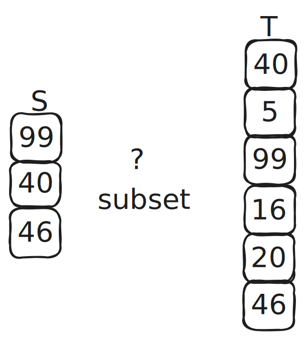
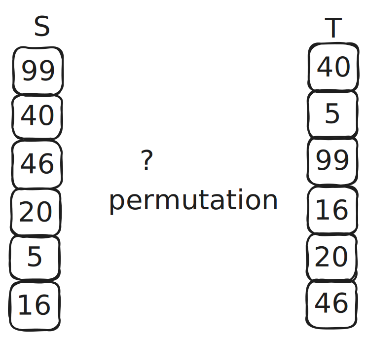
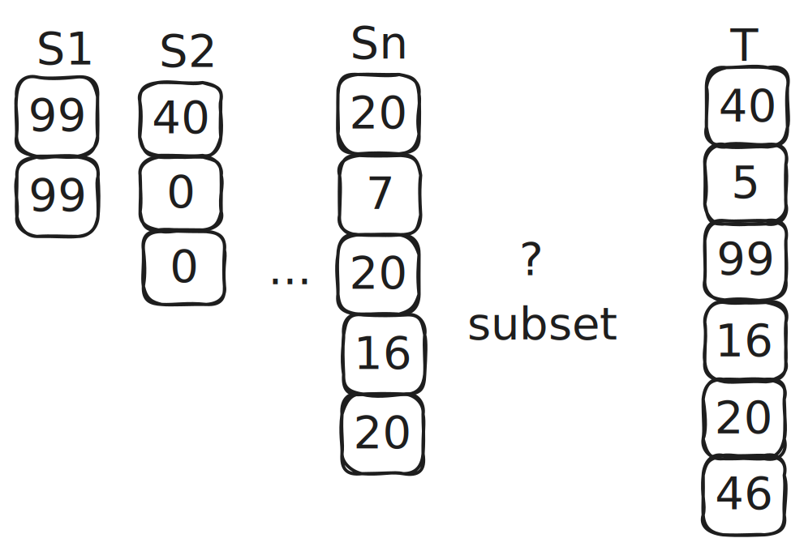

# LookUp Arguments

LookUp arguments are often used in zero knowledge virtual machines to optimize performance by reducing the number of constraints genenrated by a given program/circuit.

## Types of LookUp Arguments

Usually, lookup arguments proves the following relations.

### Subset Arguments

Whether elements in a given table \\( S \\) is a subset of another table \\( T \\).

### Permutation Arguments

Whether elements in a given table \\( S \\) is a permutation of another table \\( T \\).

### Cross Table LookUps (CTL)
In Mozak-VM, we also designed Cross Table LookUps (CTLs) that proves whether elements of a given set of tables \\(S_1, S_2, ..., S_n\\) is in another table \\( T \\).

The lookup arguments in Mozak-VM is based on [LogUp].

[LogUp]: https://eprint.iacr.org/2022/1530.pdf
