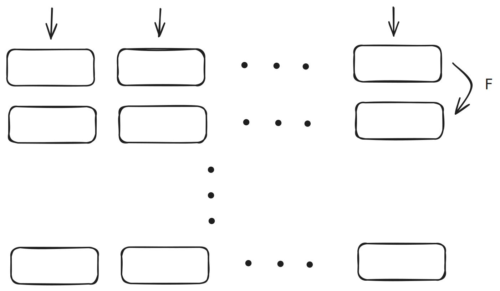

# Starky

[Starky] is an efficient Rust implementation of the Scalable Transparent ARgument of Knowledge (STARK) proving system.

## STARK Overview
A proving system allows to a prover \\( \mathcal{P} \\) prove to the verifier \\(\mathcal{V}\\) that some NP statement \\(S\\) is true. Roughly speaking, it also means that given some public inputs \\(x\\) and private inputs \\(w\\) and some program (or circuit) \\(C\\). The prover is able to prove the correct execution of the program \\(C(x,w) = y\\).

Scalable means the proving system has quasilinear time prover \\(\mathcal{P}\\) and polylogarithmic time verifier \\(\mathcal{V}\\).

Transparent means the random challenges of the verifier in these systems are public-coin.

### Construction
In STARK, execution of a program is transformed to Algebraic Intermediate Representation (AIR). 

The a row of boxes can be thought as a row of registers and each row below a given row is the new state of the program after applying a transition function $F$.

The trace is then encoded with Reed-Solomon Code, so that the claim of the execution of the program is transformed into a claim about the low degree of polynomials.

After that, the [FRI] protocol is used as a low degree testing tool for the prover to prove the claim.

### FRI
The FRI protocol consists of a commit phase and a query phase.

In the commit phase, the polynomial is commited through merkle-hashing. It is then splitted into odd and even terms and folded into one polynomail of roughtly half the degree of the original one. The new polynomial is then commited with merkle-hashing again. The process is repeated until the polynomial is a constant.

In the query phase, the verifier ask the prover to open certain indices of the merkle tree and check that the polynomail satisfy the desired properties.

We refer interested readers to the following resources that have more detailed descriptions of the protocol

1. [ethSTARK Documentation]
2. [STARK Anatomy]

To see security analysis, check out:

3. [Fiat-Shamir Security of FRI and Related SNARKs]

[Starky]: https://github.com/0xPolygonZero/plonky2/tree/main/starky
[FRI]: https://www.semanticscholar.org/paper/Fast-Reed-Solomon-Interactive-Oracle-Proofs-of-Ben-Sasson-Bentov/2415603b4e8799f575b788706be21862c055e25b
[ethSTARK Documentation]: https://eprint.iacr.org/2021/582
[STARK Anatomy]: https://aszepieniec.github.io/stark-anatomy/
[Fiat-Shamir Security of FRI and Related SNARKs]: https://eprint.iacr.org/2023/1071
