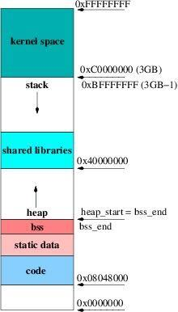

# Linker script
Linker script used while generating mozak-vm targetted program ELFs modifies the memory layout.
This document intends to clarify this in more detail.

## Without linker script
We take an example of `empty` within `examples`. Without a linker script, we build the system using
the command 
```sh
cargo +nightly build --release --bin empty
```

### Exploring via `objdump`
`objdump` utility (differently built for riscV) can be fetched via and is useful for exploring the
generated ELF
- MacOS: https://github.com/riscv-software-src/homebrew-riscv
- Others: https://github.com/riscv-software-src/riscv-tools

### Sections via normal build process
Checkout `examples/.cargo` and uncomment the "WITHOUT linker-script" `rustflags`. It should look as follows:

```toml
...
[build]
########   LINKER SCRIPT ###########
# Uncomment the following to build WITHOUT any linker script
rustflags = ["-C", "passes=loweratomic", "-Zlocation-detail=none"]

# Uncomment the following to build WITH linker script
# rustflags = ["-C", "passes=loweratomic", "-Zlocation-detail=none", "-Clink-arg=-T./.cargo/riscv32im-mozak-zkvm.ld"]
########   LINKER SCRIPT ###########
...
```

If we explore via
```
./riscv64-unknown-elf-objdump -h mozak-vm/examples/target/riscv32im-mozak-zkvm-elf/release/empty
```

we get
```
Sections:
Idx Name          Size      VMA       LMA       File off  Algn
  0 .rodata       00000254  000100f4  000100f4  000000f4  2**2
                  CONTENTS, ALLOC, LOAD, READONLY, DATA
  1 .text         000013a0  00011348  00011348  00000348  2**2
                  CONTENTS, ALLOC, LOAD, READONLY, CODE
  2 .data         00000014  000136e8  000136e8  000016e8  2**0
                  CONTENTS, ALLOC, LOAD, DATA
  3 .sdata        00000008  000136fc  000136fc  000016fc  2**2
                  CONTENTS, ALLOC, LOAD, DATA
  4 .sbss         0000000c  00013704  00013704  00001704  2**2
                  ALLOC
  5 .comment      00000048  00000000  00000000  00001704  2**0
                  CONTENTS, READONLY
  6 .riscv.attributes 00000021  00000000  00000000  0000174c  2**0
                  CONTENTS, READONLY
```
Excerpt from [Stack Overflow](https://stackoverflow.com/questions/6218384/virtual-and-physical-addresses-of-sections-in-elf-files):

Every loadable or allocatable output section has two addresses. The first is the VMA, or virtual memory address. 
This is the address the section will have when the output file is run. 
The second is the LMA, or load memory address. This is the address at which the section will be loaded. In most cases the two addresses will be the same.

An example of when they might be different is when a data section is loaded into ROM, and then copied into RAM when the program starts up (this technique is often used to initialize global variables in a ROM based system). In this case the ROM address would be the LMA, and the RAM address would be the VMA.

"VMA" and "LMA" are GNU utility terminology and not in the ELF specification. Once you get down to looking at it from interpreting an ELF executable file, you will find that there is a program header field called "p_paddr" and another called "p_vaddr".

Here are scenarios where VMA and LMA might differ (not used, just for docs):

- Position-Independent Executables (PIE): When creating position-independent executables (PIE) or shared libraries, the loader might relocate the program in memory to avoid collisions with other programs. In such cases, the VMA addresses (addresses during execution) might differ from the LMA addresses (addresses at which the program is loaded).

- Address Space Layout Randomization (ASLR): Some operating systems use ASLR, which randomizes the base address of a program or shared library in memory at load time. This randomization might cause the VMA and LMA to differ as the loaded address can vary from one execution to another.

For most of our use cases we can consider them as equal in values.

The file off means the file offset for the section. In the example above, .text section starts from `0x00000348` in a file.

### Sections via custom linker script for reserved memory
Checkout `examples/.cargo` and uncomment the "WITH linker-script" `rustflags`. It should look as follows:

```toml
...
[build]
########   LINKER SCRIPT ###########
# Uncomment the following to compile WITHOU any linker script
# rustflags = ["-C", "passes=loweratomic", "-Zlocation-detail=none"]

# Uncomment the following to compile WITH    linker script
rustflags = ["-C", "passes=loweratomic", "-Zlocation-detail=none", "-Clink-arg=-T./.cargo/riscv32im-mozak-zkvm.ld"]
########   LINKER SCRIPT ###########
...
```
Based losely on the following setup:



Same build now reveals the following sections:
```
Idx Name          Size      VMA       LMA       File off  Algn
  0 .text         000013a0  01000000  01000000  00001000  2**2
                  CONTENTS, ALLOC, LOAD, READONLY, CODE
  1 .rodata       00000254  10000000  10000000  00003000  2**2
                  CONTENTS, ALLOC, LOAD, READONLY, DATA
  2 .mozak_globals 00000000  00000000  00000000  00003254  2**0
                  CONTENTS, ALLOC, LOAD, READONLY, DATA
  3 .sbss         00000014  40000000  40000000  00004000  2**2
                  CONTENTS, ALLOC, LOAD, DATA
  4 .data         00000014  40000014  40000014  00004014  2**0
                  CONTENTS, ALLOC, LOAD, DATA
```
It's worth noting that now we see new additions `.mozak_globals` as well as `.sbss` and `.data` in their relevant VMA/LMA location `0x40000000`+.
